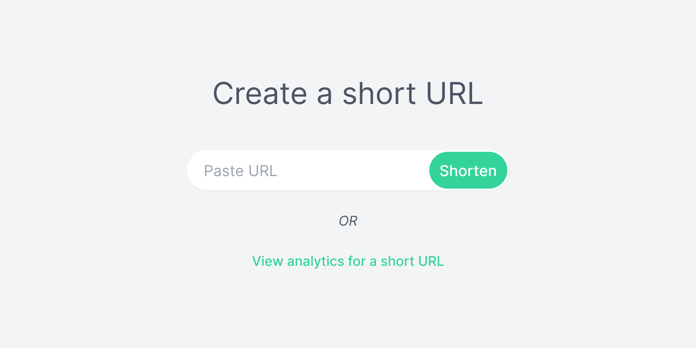

# Midget Gems

An URL shortener service for your precious links.

## User stories

The application supports the following user stories.

- As a user, I want to submit an URL and receive a short URL in return
- As a user, when I navigate to the short URL I want to be redirected to the original URL
- As a user, navigating to the short URL should increase the visit count by 1
- As a user, I want to submit a short URL and see how many times it has been visited
- As a user, when I navigate to a non-existing short URL I should see a page informing the URL doesn't exist

### Addtional requirements

- Short URLs should not be easy to guess
- Submitting the same URL more than once should return its corresponding short URL instead of creating a new short URL
- Check if a URL is already a short URL to avoid shortening a short URL
- Check if the URL leads to a valid page before shortening it
- Make it harder to shorten URLs that lead to known malicious sites (short URLs are often used by scammers)

## Built with

### Backend application

The backend application is built with Node.js. The application use:

- TypeScript for type safety and better tooling.
- Express.js for setting up a basic server.
- Postgres.js to connect with a Postgres database. Postgres.js was selected before the more common node-postgres beacause of its simple surface API and dynamic query support.
- NanoID for generating short URL's.

The backend application lives inside the `./backend` folder.

To start the backend application locally, run `npm run backend` from the project root directory `./`.

By default, the backend application will run on port 8080.

### Persistent storage

The application use a Postgres database for persistent storage and Postgres.js to connect db with the backend.

### Front-end application

The frontend is built by Maxim Orlov. It is not part of the version control.

The front-end application lives inside the `./frontend` folder.

To start the front-end application locally, run `npm run frontend` from the project root directory `./` and go to `http://localhost:3000` in your browser.

By default, the front-end applicaton will run on port 3000. If you wish to use a different port, change the `PORT=` value inside `./package.json`.

The app will try to reach the back end at `http://localhost:8000`. You can configure this by changing the `API_URL` variable inside the `./frontend/.env` file.

## Credits

Credits to [Maxim Orlov for](https://maximorlov.com/) for providing the frontend and project setup. Awesome stuff, highly recommend.

## License

Licensed under the MIT license.
